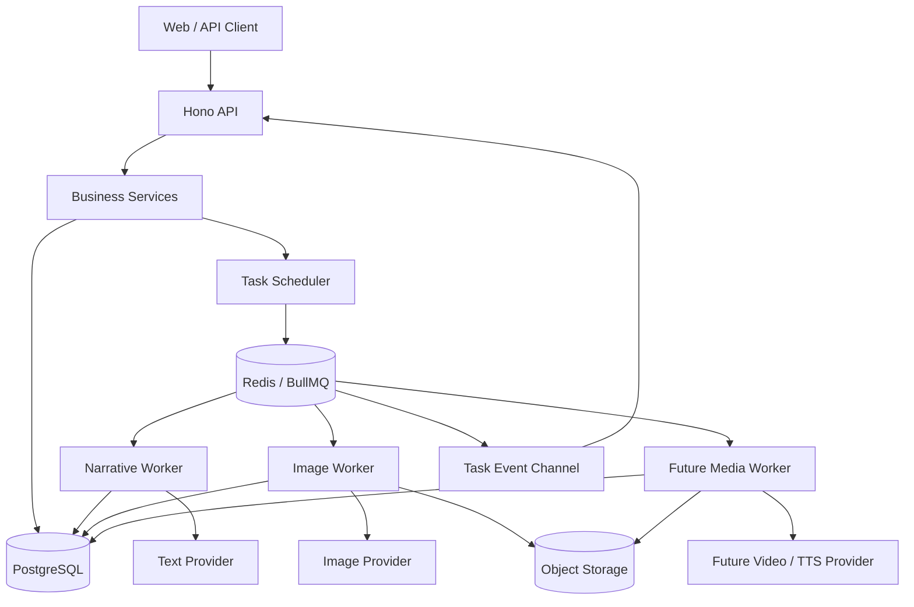

# AI 漫剧生成后端架构优化重构方案

> 本文是后端下一阶段的重构基线，面向任务拆分、实施和验收。它描述目标状态，**不是已完成能力清单**。当前系统仍为单人、单部署、SQLite + 进程内 Worker；Phase 1 与 Phase 2A–2C 已完成，视频、TTS、字幕和合成仍暂停。

关联文档：`architecture.md`（总体架构）、`backend-architecture.md`（实现现状）、`database-design.md`（数据模型）、`agent-workflow.md`（Agent/Runner 边界）、`api-design.md`（现有 API）、`provider-adapter.md`（Provider）、`task-stream.md`（SSE）和 `phase-roadmap.md`（阶段路线）。

## 实施进度（2026-07-22）

已完成第一阶段的任务可靠性底座：SQLite 启用 `busy_timeout`（同时保持 WAL 与外键）；`generation_tasks` 已具备 Worker lease、心跳、退避重试、取消请求、错误分类、上游 revision/idempotency key 预留及修复计数；进程内 Worker 已实现过期租约回收、心跳续租、带抖动的指数退避和协作式取消；`generation_jobs` 数据模型已建立；`POST /api/generation-tasks/:taskId/cancel` 已可取消排队任务或请求取消运行任务。

第二阶段已建立每集 `episode_pipeline_states` 的 revision/stale 持久化模型；剧本人工编辑与 ScriptAgent 成功写入会递增 script revision，并标记该集资产、分镜和图片为 stale；ExtractAgent、StoryboardAgent 和分镜首帧成功写入会分别推进 asset/storyboard/image revision、清除本阶段 stale 并使其下游过期；`GET /api/episodes/:episodeId/pipeline-status` 返回由真实数据、任务和 stale 标记派生的阶段状态。

第三阶段已完成首个批量编排闭环：分镜首帧批量提交创建 `generation_jobs` 父记录并关联子任务；Worker 在子任务每次结算后持久化聚合进度；提供 Job 查询和协作式取消。其他批量入口与 revision-aware 幂等复用仍待逐步迁移。

尚未实施的目标保持为后续工作：生成服务的 revision 递增与完整失效传播、幂等键写入/复用、Job 子任务聚合与进度 API、费用/用量记录、Zod 自动修复、备份自动化、对象存储和 PostgreSQL/BullMQ 迁移。它们不得被误认为已完成。

## 1. 目标与原则

当前主链路为：

```text
小说章节 → 事件抽取 → 分集规划 → 剧本生成 → 资产抽取 → 分镜生成 → 参考图 / 首帧图
```

本次重构不改变业务方向，也不提前实现视频链路；先补强异步可靠性、版本失效、成本治理和批量编排，为未来扩展建立底座。

优先级：

```text
不重复计费 > 不丢任务 > 不误删用户数据 > 可恢复 > 可扩展 > 性能优化
```

持续遵守以下边界：

```text
HTTP Route → Business Service → Task Scheduler → Task Handler / Agent → Provider → Database / Storage
```

- Route 只做鉴权、校验与响应格式化；不得直接调用 Provider。
- Service 负责业务规则、依赖检查、事务与任务创建。
- Worker 负责认领、租约、超时、重试和事件发布。
- Handler/Agent 负责具体业务；业务写入与成功终态在同一事务中提交。
- Provider 负责模型 API 差异、错误归一化和调用记录。
- 所有耗时生成均须持久化为任务；所有 Agent 输出须经 Zod 校验。
- 以渐进替换实施：先完善 SQLite/进程内 Worker 协议，再迁移 PostgreSQL、队列和对象存储。

## 2. 目标架构



此图表达演进目标，不要求当前立即拆分部署。当前实现保持 API 与进程内 Worker 单实例，SSE 事件总线仍为进程内。

## 3. 可靠任务协议（P0）

### 3.1 状态、责任与事务

任务状态机：

```text
pending → running → completed
                  ↘ failed
                  ↘ retry_wait → pending
                  ↘ cancelled
```

- Runner 在同一数据库事务内写入业务产物和 `completed`，避免“业务已提交、终态未写入”导致的重复执行。
- Worker 仅依据标准错误分类决定重试、退避、超时回收与最终失败；Handler 不决定重试策略。
- 迁移 BullMQ 后，队列状态与数据库状态需通过 Outbox/Inbox 或补偿机制协调；不能假设队列本身提供业务 exactly-once。

### 3.2 租约、恢复与取消

`generation_tasks` 计划增加：`locked_by`、`locked_at`、`heartbeat_at`、`lease_expires_at`、`started_at`、`finished_at`、`next_retry_at`、`timeout_seconds`、`error_code`、`error_details_json`。

- Worker 认领时取得租约、执行中续租；扫描器回收过期租约。
- 失败分类：`validation_error`、`rate_limited`、`provider_timeout`、`content_rejected`、`configuration_error`、`dependency_not_ready`、`internal_error`。
- 429 与临时超时使用带抖动的指数退避；审核拒绝、配置错误不自动重试。
- 增加 `POST /api/generation-tasks/:taskId/cancel`，父 Job 取消未执行子任务；Provider 不支持中断时，完成后不得回写已失效目标。

### 3.3 幂等与可重入产物

任务幂等键使用真正的上游版本：

```text
(project_id, target_type, target_id, task_type, upstream_revision)
```

为该键建立唯一约束。活动任务复用原任务；已完成且产物有效时复用结果；`force=true` 显式创建新的 generation revision。不要以运行时拼装的 Agent Context 哈希作为幂等依据。

图像写入必须可重入：先检查本任务已有 `assets`，以 `task_id + asset_type` 推导稳定存储 Key；按“下载临时文件 → 持久化文件 → 写 assets → 回写目标 URL → 更新终态”逐步检查与补齐。Provider request ID 用于对账和排障，不能作为历史结果可查询的前提。文本调用仍存在“Provider 已返回而事务前崩溃”的小窗口，应记录调用时间与成本并缩短提交路径，而不虚假承诺 exactly-once。

### 3.4 结构化输出修复

Zod 首次校验失败时保存原始输出，将字段路径、期望类型和原因反馈给模型，仅请求修正 JSON，再校验一次。`repair_count` 与基础设施 `retry_count` 分离；一次调用最多修复一次，第二次仍失败即记为 `validation_error`。

## 4. Revision、失效与生产状态（P0/P1）

### 4.1 内容版本

为 planning、script、asset extraction、storyboard、image generation 引入 revision；下游记录依赖的上游 revision。Revision 同时是任务幂等和旧任务回写隔离的依据。

| 上游变化 | 需标记 stale 的下游 |
| --- | --- |
| 章节事件或分集事件链接变化 | 分集规划、剧本、资产、分镜、图片 |
| 剧本修改 | 资产、分镜、相关图片 |
| 角色描述或形象变化 | 角色参考图、引用该形象的分镜首帧 |
| 场景描述变化 | 场景参考图、引用该场景的分镜首帧 |
| 分镜 Prompt 变化 | 对应首帧图（未来含视频） |

默认仅标记 `stale`，不物理删除。重规划执行“新 planning revision → 影响预览 → 用户确认 → 切换 active revision → 旧版本标记 `superseded` → 取消未执行旧任务”。旧版本按保留策略清理，支持比较与回滚。手动角色形象版本优先锚定 episode/event，而非易变的绝对集号。

### 4.2 派生管线状态

不在 Episode 上持久化多阶段冗余状态。新增统一查询 `computeEpisodePipelineStatus(episodeId)`，对外返回阶段：`events_ready`、`planning_ready`、`script_ready`、`assets_ready`、`storyboards_ready`、`images_ready`；每阶段显示 `not_started` / `queued` / `running` / `ready` / `stale` / `failed`。

`ready` 由有效 revision 的业务行推导，`queued/running/failed` 由同 revision 任务推导，`stale` 由稳定 revision 对比或持久化标记得出。Service 入队前校验依赖，避免下游在上游未就绪或已过期时执行。

## 5. Job、数据、Provider 与存储

### 5.1 批量 Job

增加 `generation_jobs`，表示一次用户发起的批量生产；其下包含多条 `generation_tasks`。Job 记录项目、Episode、发起人、预计成本、状态、取消时间以及 `total/pending/running/succeeded/failed/skipped` 计数和进度。前端订阅 Job 进度，而非自行汇总大量 Task；支持整 Job 取消和失败项重试。

### 5.2 数据与审计

- 对 `target_type`、`task_type` 建立枚举/CHECK；服务层统一验证多态目标，删除目标时标记相关任务/资产失效，并巡检孤儿数据。
- 任务表只保留调度字段和结果摘要；大型输入、原始输出与 Provider 响应存对象存储，数据库保存 URI、哈希、大小、内容类型和保留策略。
- 每次调用记录 Agent/Prompt/Schema 版本、Provider/模型/request ID、参数、输入 revision、Token、费用、耗时、审核结果与重试次数。
- 建立 `request_id → job_id → task_id → agent_run_id → provider_request_id → asset_id` 关联链路；日志不得输出密钥、完整鉴权头或未脱敏敏感内容。

### 5.3 Provider 能力

Provider Adapter 计划暴露能力描述：

```ts
interface ProviderCapabilities {
  structuredOutput: boolean;
  imageInput: boolean;
  maxContextTokens?: number;
  supportedImageSizes?: string[];
}
```

Adapter 统一管理超时、退避、熔断、错误归一化、一次 JSON 修复、临时资源下载校验、request ID、Token/成本和审核结果。当前保持文本与图像 Provider 缺配即启动失败；仅在实际出现纯叙事/纯图像部署时再考虑能力降级。

### 5.4 存储与安全

抽象 `AssetStorage`：`put`、`getSignedUrl`、`delete`、`exists`。先实现 `LocalAssetStorage` 兼容当前 `data/static`，后续增加 S3/R2/COS，生产使用私有 Bucket 和签名 URL。Provider 下载必须限制协议、允许域名、文件大小、MIME 与超时，防止 SSRF 和异常大文件；并提供临时文件、孤儿资产和旧 revision 清理机制。

## 6. SQLite 稳定性与成本治理（P0）

SQLite 初始化设置：

```sql
PRAGMA journal_mode = WAL;
PRAGMA busy_timeout = 5000;
PRAGMA foreign_keys = ON;
```

保持保守并发，并监测 WAL checkpoint。使用 SQLite Online Backup API 或 `sqlite3 .backup` 生成一致性备份；每日备份、高风险操作前额外备份、保留最近 7 日与 4 周、写入不同目录并执行 `PRAGMA integrity_check`。必须演练恢复，且为本地图片建立备份或可重建策略。

优先记录每次调用的 Token、图片数、模型单价快照和估算费用（或独立 `usage_records`），批量提交前计算预计成本，对明显高成本操作二次确认，并可按项目查看累计费用。完整用户/团队/权限/配额体系在开放注册或出现第二个实际用户前暂缓。

## 7. 基础设施演进与阶段计划

| 阶段 | 数据库 | 队列/事件 | 存储 | 交付重点 |
| --- | --- | --- | --- | --- |
| 当前 MVP | SQLite | DB 表 + 进程内 Worker/SSE | 本地目录 | 已完成叙事与图像主链路 |
| 阶段一 | SQLite | 可靠任务协议 | 本地存储接口 | WAL/备份、租约、幂等、错误/成本 |
| 阶段二 | SQLite | 同上 | 同上 | revision、stale/superseded、失效传播 |
| 阶段三 | SQLite | Job/Task 编排 | 同上 | 批量 Job、派生状态、进度/取消 |
| 阶段四 | PostgreSQL | BullMQ/Redis 或 PG 队列与跨进程事件 | S3/R2/COS | 多实例、独立 API/Worker、监控 |
| 阶段五 | PostgreSQL | 分类型 DAG 队列 | 对象存储/CDN | 仅在前四阶段验收后接入视频/TTS/合成 |

阶段一验收：崩溃/超时可恢复；重复请求不重复执行；429 退避；配置与审核错误不盲重试；备份可恢复。  
阶段二验收：上游修改精确标记 stale；不受影响产物不重生成；旧 revision 不能覆盖新 revision。  
阶段三验收：数百任务不阻塞 API；Job 进度准确、可取消、失败项可重试；任务类型并发隔离。  
阶段四验收：多实例不重复执行；实例重启不影响其他任务；SSE 重连以数据库状态恢复；文件不依赖单机磁盘。

## 8. 测试、观测与非目标

新增单元测试：Schema 修复、失效传播、错误分类/退避、形象版本、成本计算。新增集成测试：并发认领、429/超时/审核拒绝、租约恢复、提交前崩溃、旧 revision 回写隔离、Job 取消聚合。新增端到端测试：小说至首帧、剧本修改后的增量重生成、整集批量进度与重连、Provider fail-fast。

监控队列长度与最老等待时间、各任务成功率与 P50/P95/P99、重试/超时/租约过期、Provider 429/5xx/审核拒绝、调用成本、项目并发、孤儿资产和 stale 数据量。

本轮明确不做：视频/TTS/字幕/FFmpeg/成片导出、一次性替换全部技术栈、无业务收益的大规模目录迁移、仍可回滚数据的物理删除、无幂等/预算控制的全项目一键生成，以及在没有真实需求时提前建设多租户。
